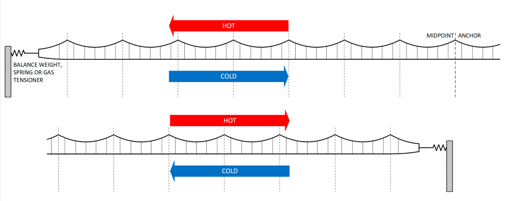
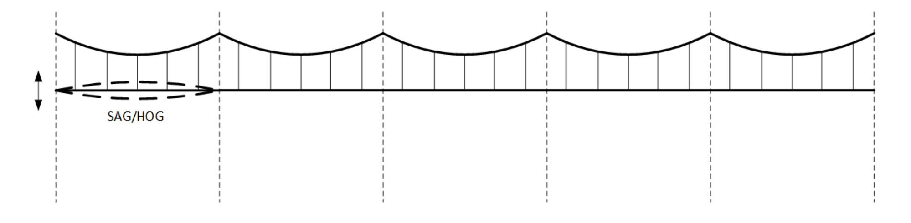
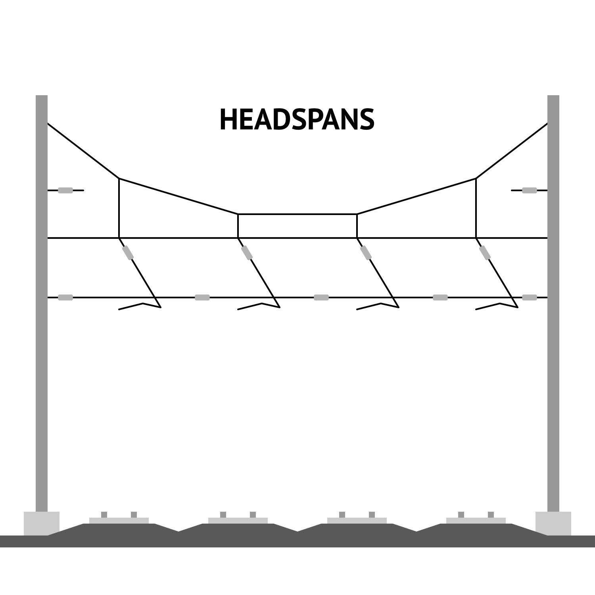
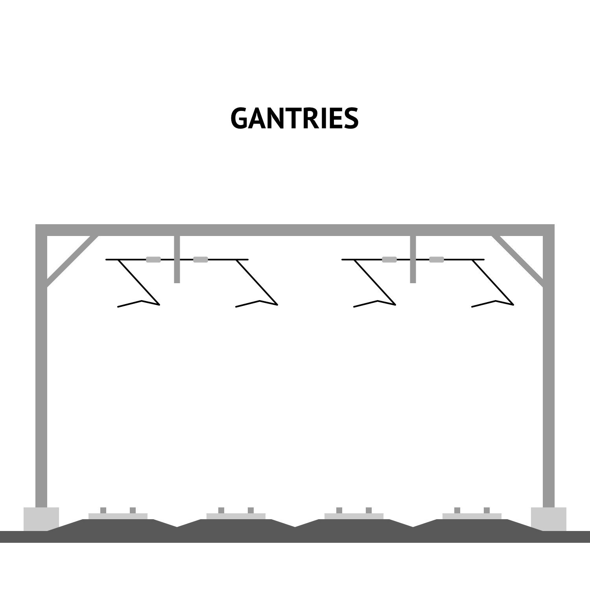
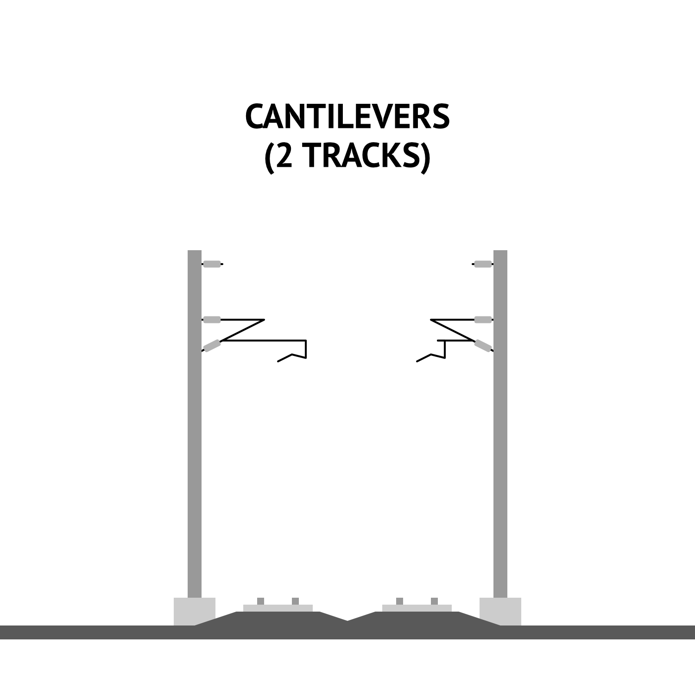

# Electrical Power Systems

Electrical trains need to be powered.
In almost all cases, the best way to do this is not by having trains carry their own energy supply, as diesel and coal trains do, but to be connected to the electrical grid to receive externally-generated power continuously.
Such power systems can be broken down into overhead and "third rail" systems.

## Overhead Catenary Wire

Catenary wire is strung up over the tracks.

Rolling stock which needs power is connected to the overhead wire with a *pantograph*.

Modern overhead wire systems for mainline rail are typically at higher voltages AC, such as 25 kV.

### Catenary Tensioning System

Catenary wire needs to be properly tensioned to function.
This can be done in two ways: the simpler one is called *variable tension* or *fixed termination*;
the other, more advanced one is called *constant tension* or *auto-tension*.
Most of the catenary in the United States has variable tension.
While variable tension systems are simpler to build, they can only operate within a specific temperature range, as metal expands in the heat and contracts in the cold;
constant tension installations resolve this problem.
Another problem of variable-tension catenary is that it limits trains to 135 mph in its most common configuration, with a few recently upgraded sections allowing slightly faster running.
This limitation prevents pressure waves that moving trains create in variable tension wire from damaging the catenary or causing a train to lose power.

Variable-tension catenary involves fixing wires to every support structure.
The following figure, taken from [Garry Keenor’s Overhead Line Electrification for Railways 6th Edition](http://ocs4rail.com/), illustrates the view from the track side, with the bottom line representing the contact wire:

Between each anchor point, the wire sags in the heat and rises (hogs) in the cold.
What’s more, metal catenary wire often ends up considerably hotter than the air.
The resultant deformation increases the risk of pantographs felling wires or becoming damaged themselves, both of which require major repairs that stop service.
In London, summer heat reaching about 90 °F in 2011 led the catenary wire to record 167 °F temperatures, [leading to train cancellations as the wire lost tension](https://www.railway-technology.com/features/featuretension-and-strain-on-overheated-trains/?cf-view).
This episode led to the installation of constant-tension catenary, as shown in the figure below, taken from Keenor’s book as well:

Constant-tension catenary only anchors each stretch of wire at its midpoint.
The wire slides along all the other supports as it expands and contracts.
Weights or spring tensioners at each end maintain the wire’s tension.
Spring tensioners are usually preferable for lines with three or more tracks, as they avoid the need to run wires for one track across those of another to reach the side of the right-of-way, where weights are usually located.
While constant tension catenary requires more complex engineering, the wire’s performance does not suffer in the heat or cold, and the maximum speed is therefore higher.
Constant-tension catenary is not something at all unique to high-speed rail:
[recent installations](https://www.nextlevelcommercial.com/docs/I-15.pdf) [have sold](https://www.mosdorfer.com/en/produkte/railway/) in countries with no trains faster than 125 mph.

### Headspans, Gantries, and Cantilevers

There are three ways to suspend catenary wire above track:
*headspans*, *gantries* (also known as *portals*), and *cantilevers*.

Source: Kara Fischer, ETA

Headspans and gantries differ in that headspans suspend the catenary from flexible wires, whereas gantries do so from fixed metal structures.
Gantries have the ability to provide mechanical independence:
if one track’s catenary wire fails, it doesn’t impact the other tracks’ power supply, and it’s possible to do maintenance on one track’s wire without disturbing the others.
While simpler to install, than gantries or cantilevers, headspans can not furnish mechanical independence.
They are not reliable enough for this reason.
Cantilevers can be installed either to the side of tracks or between a pair of adjacent tracks, suspending wires above each on independent hangers;
this provides mechanical independence, like gantries, at the cost of requiring more spacing between tracks than the other options.

This [video](https://youtu.be/y7P__pLbmvk?si=0s-1fyOdReRYdIr2) from the Permanent Way Institution describes some of the various tradeoffs of the different styles of structures.
British engineer Noel Dolphin [has written about a method of converting headspans to gantries](https://x.com/noeldolphin/status/1801338827983770032) that minimizes multi-track outages.

## Third Rail

A "third rail" was originally just that, a third rail not used to support the train, but instead power it.
(Modern third rail has diverged in material and shape from regular rail, but the name has stuck.)

The third rail is much thicker than a regular wire, and as such can carry higher currents.
At the same time, being right at ground level, and less well insulated, the third rail requires lower voltage.
Lower voltage but higher current roughly cancels out in terms of power (their product), however.

### Inferiority

The physical power delivery mechanism itself are much more expensive for third rail.
Third rails only last about 20 years.[^third-rail-bart]
Overhead wire itself and insulators, by contrast, typically lasts over twice as long as that[^overhead-wire-longevity],
and the support poles often last even longer at over 100 years.
Together, these costs and lifespans make the amortized costs of overhead wire construction and maintenance far lower.

[^third-rail-bart]: <https://www.bart.gov/news/articles/2019/news20190731>

[^overhead-wire-longevity]: <https://www.sdtools.com/pdf/WCRR11_fatigue.pdf>

Third rail also requires the amount of supporting infrastructure needed.
Because a third rail can only handle low voltages, each substation can only feed a few miles of track.
By contrast, a substation feeding high-voltage AC to an overhead wire can instead cover tens of route miles each.
More frequent substations and associated transmission (connecting the right-of-way to the substations, and the substations to the grid) drives the cost of new third rail higher than new overhead wire.

Other maintenance beyond the power system becomes much simpler, easier, and safer, with overhead catenary wire – the efficiency gains from better power systems extend beyond the power systems itself.
With third rail, just about any track-level maintenance requires cutting power to the third rail if present.
By contrast, since overhead wire is out of the way of both equipment of workers, it can safely be kept powered on during many maintenance operations.
Modern maintenance of way (MOW) equipment can have height limiters installed to avoid strikes or arcing, safely enabling tasks like replacing track components like bolts, tie spikes, or clips without deenergization.
For many ground-level track renewal tasks (tie, ballast, etc.), the third rails (and covers) are physically in the way and have to be removed and reinstalled for the work to go ahead, adding significant time and expense.
By contrast, overhead wire is not in the way and can be left in place.
